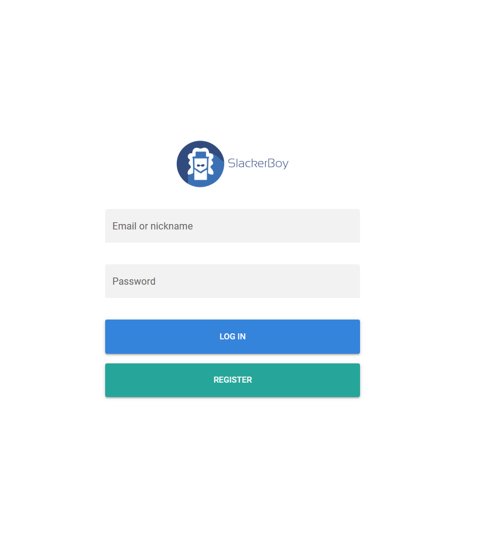
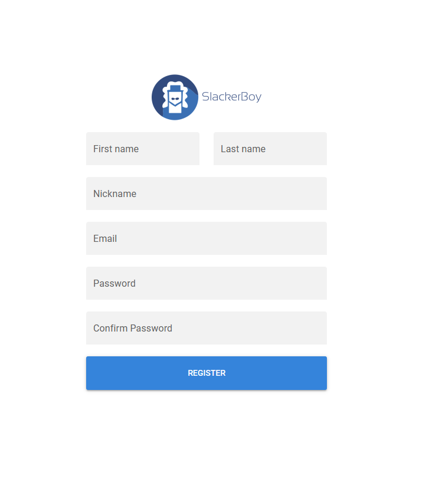
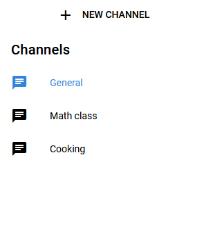
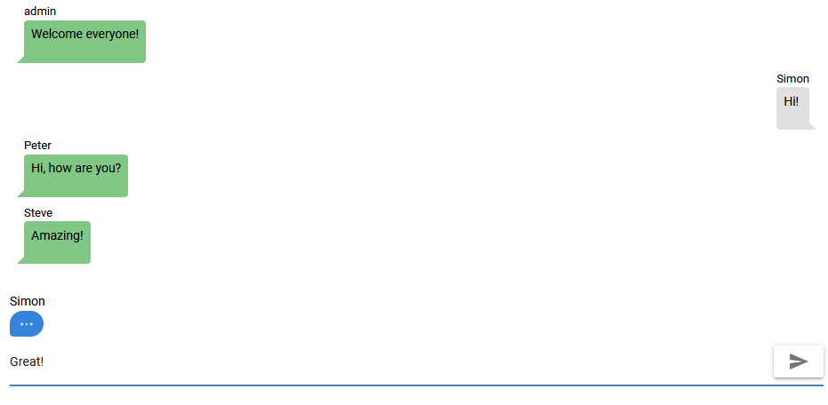
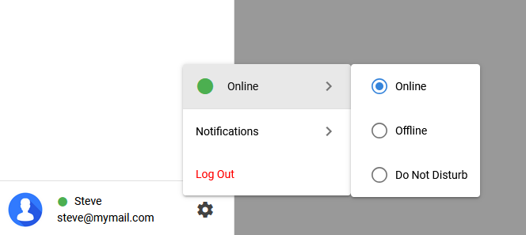

# vpwa (vpwa-project)

Marián Gomola, Šimon Bystrický

## Goal

The goal is to create an application similar to `Slack`, where users can communicate in channels
using `Vue.js` framework with `Quasar` for `frontend` and `Adonis.js` framework for the `backend`.
The project will have these features:
- User can send and read messages in `realtime` (using WebSockets)
- Efficient `infinite scroll`
- User `registration` and `login`
- User can create, join, delete a channel
- User can see a list of users in a channel
- User can see a list of channels
- Native `notifications` and toasts

and more.

### Read README.md in [backend](backend/README.md) and [frontend](frontend/README.md) folders for project setup and run instructions.

## Screenshots

